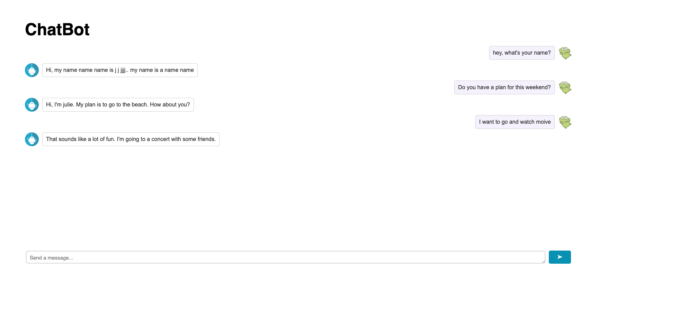

# Chatbot
This chatbot uses the BlenderBot-400M-distill model with 400 million parameters, making it suitable for local PC (CPU-only) setups. While it performs well, it may not match the capabilities of larger models like GPT-3.5.

- Flask, Hugging Face
- Python, HTML, CSS Javascript

